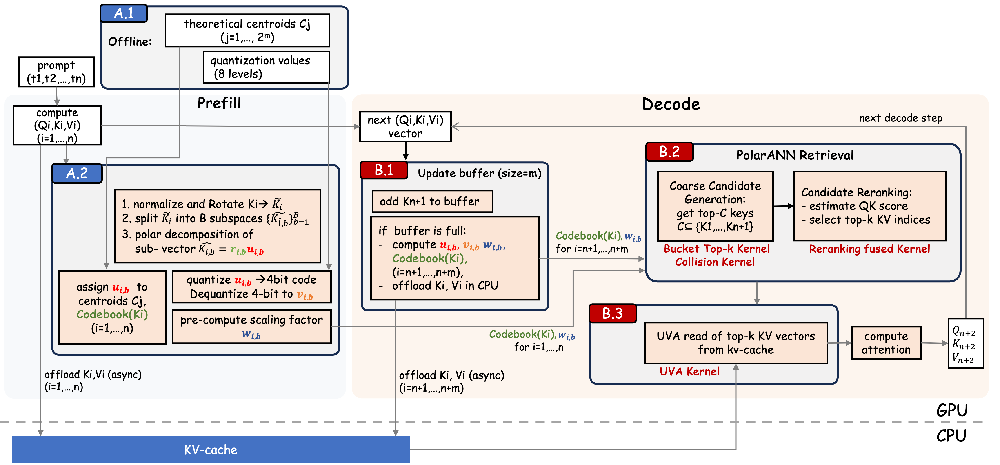
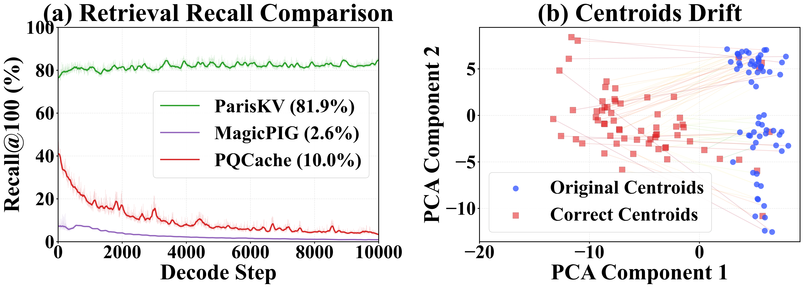
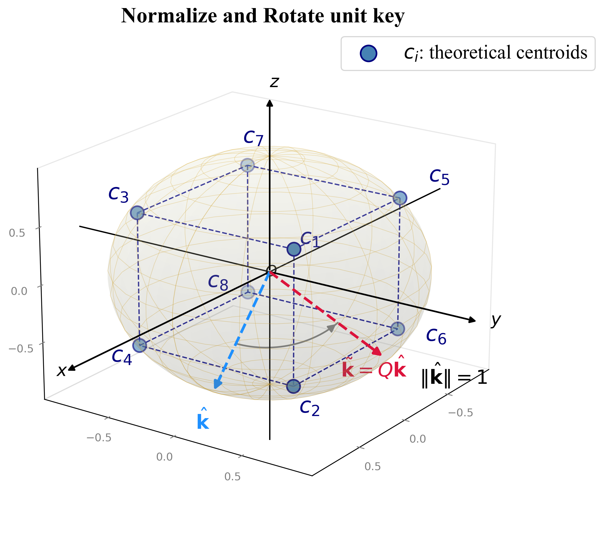
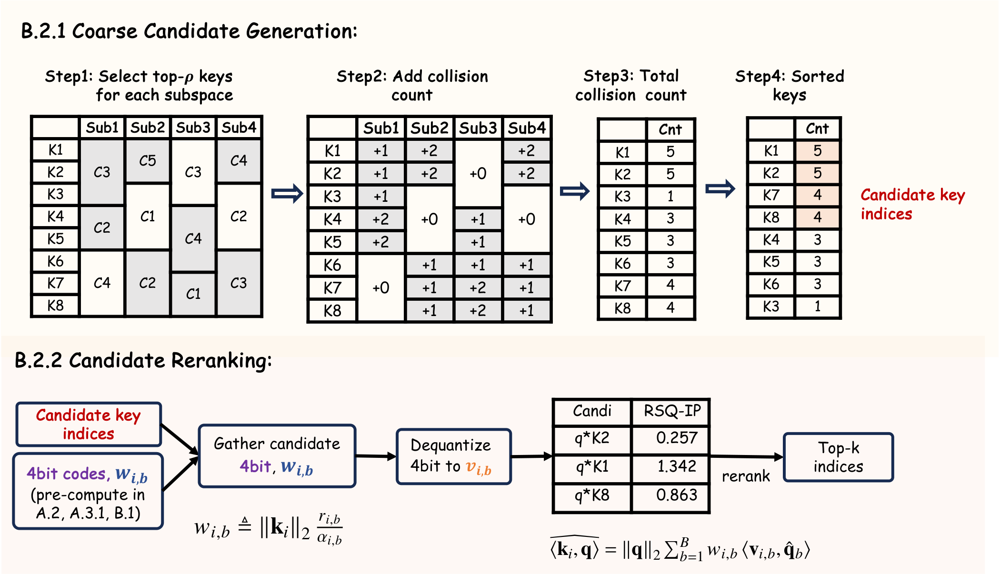

# ParisKV

<p align="center">
  <b>Fast and drift-robust KV-cache retrieval for long-context LLM inference</b>
</p>

<p align="center">
  <a href="https://arxiv.org/abs/2602.07721"></a>
  <a href="https://openreview.net/forum?id=wxD4wTYQXt"></a>
  
  
  
  
</p>

<p align="center">
  <a href="#key-insight">Key Insight</a> |
  <a href="#why-pariskv">Why ParisKV</a> |
  <a href="#quick-start">Quick Start</a> |
  <a href="#evaluation">Evaluation</a> |
  <a href="#project-layout">Project Layout</a>
</p>

ParisKV is an algorithm-system co-design for accelerating long-context decoding.
Instead of scanning the entire KV cache at every decode step, ParisKV keeps compact
GPU-resident key summaries, retrieves a high-recall Top-k candidate set with
PolarANN, reranks candidates with 4-bit RaBitQ-style inner-product estimates, and
fetches only the selected KV pairs from CPU memory through UVA.

<p align="center">
  
</p>

## Key Insight

ParisKV accelerates long-context LLM inference with drift-robust KV-cache
retrieval. Unlike methods that learn centroids only from prefill keys, which may
become stale during long generation, ParisKV maps queries and keys to a stable
unit-hypersphere space and defines analytic, uniformly distributed centroids
there. As decoding evolves, newly generated keys remain close to at least one
centroid, allowing ParisKV to maintain stable retrieval quality under
distribution drift. With a GPU-native coarse-to-fine retrieval pipeline and
UVA-based KV-cache offloading, ParisKV scales to million-token contexts while
matching or even outperforming full attention, achieving up to 2.8x higher
throughput and 17x / 44x lower decode latency than MagicPIG and PQCache.

<p align="center">
  
  <br>
  <sub>Fig. 1: ParisKV keeps Recall@100 stable during long decoding, while prefill-only centroids drift away from the evolving key distribution.</sub>
</p>

## Why ParisKV

Long-context LLM decoding is memory-bound: every generated token requires reading
KV vectors from all previous tokens. Retrieval-based sparse attention solves this
by selecting only the most relevant past tokens, but existing ANN-based KV-cache
systems often suffer from stale learned centroids, CPU-side retrieval overhead, or
accuracy loss from aggressive compression.

ParisKV is designed around three principles:

- **Drift-robust retrieval.** Normalize and rotate keys/queries, then use
  data-independent analytic centroids on the unit sphere. No per-layer K-means
  clustering is needed at prefill time.
- **GPU-native coarse-to-fine search.** A collision-voting stage finds coarse
  candidates from compact codebook IDs; a fused reranking stage estimates
  query-key scores from 4-bit key summaries.
- **Scalable KV offload.** Full-precision KV tensors can live in pinned CPU
  memory, while GPU kernels fetch only the final selected Top-k vectors through
  Unified Virtual Addressing.

From the ParisKV paper, the system:

| Result | Summary |
| --- | --- |
| Quality | Matches or exceeds full attention in 7/9 long-generation settings. |
| Throughput | Up to 2.8x higher decode throughput than full attention within full attention's runnable range. |
| Million-token latency | 17x lower decode latency than MagicPIG and 44x lower than PQCache at 1M-token scale. |
| Scalability | Runs on long contexts where full attention runs out of GPU memory. |

## Features

- **Analytic PolarANN codebook.** Sign-pattern direction centroids are fixed,
  data-independent, and cheap to assign.
- **SRHT normalize-rotate preprocessing.** Inner products are preserved while
  representations become more stable for subspace retrieval.
- **Multi-tier collision retrieval.** Candidate generation uses weighted
  subspace collisions to prune the retrieval zone without dense scoring.
- **4-bit reranking metadata.** Each coordinate uses 1 sign bit plus a 3-bit
  magnitude index; per-subspace weights calibrate the inner-product estimator.
- **Custom CUDA kernels.** Collision counting, bucket Top-k, fused reranking,
  adaptive Top-k variants, and UVA KV fetching are implemented as GPU kernels.
- **Long-generation support.** A sink/local/update-buffer layout keeps recent
  tokens dense while asynchronously indexing and offloading older tokens.

## Installation

The tested setup is CUDA 12.4 with Python 3.10+.

```bash
conda create -n pariskv python=3.10 -y
conda activate pariskv

conda install -y mkl
conda install -c conda-forge libstdcxx-ng -y

pip install -r requirements.txt
pip install "flash-attn>=2.7.0" --no-build-isolation
pip install "flashinfer-python>=0.2.4" -i https://flashinfer.ai/whl/cu124/torch2.5/
```

CUDA extensions are compiled on first use through PyTorch's extension loader.

## Quick Start

The current model adapter path is Qwen-family models through
`model_hub/qwen.py`.

```python
import torch
from model_hub.qwen import QwenModel

model_name = "Qwen/Qwen3-8B"

llm = QwenModel(
    model_name=model_name,
    max_length=131072,
    dtype=torch.bfloat16,
    device_map="cuda:0",
)

if llm.tokenizer.pad_token is None:
    llm.tokenizer.pad_token = llm.tokenizer.eos_token
llm.tokenizer.padding_side = "left"

messages = [
    {"role": "system", "content": "You are a helpful assistant."},
    {"role": "user", "content": "Summarize the key idea behind ParisKV."},
]
prompt = llm.tokenizer.apply_chat_template(
    messages,
    tokenize=False,
    add_generation_prompt=True,
)
inputs = llm.tokenizer([prompt], return_tensors="pt", padding=True)
device = llm.layers[0].device

generated_ids, stats = llm.generate(
    attention_type="PolarANN",
    inputs_ids=inputs.input_ids.to(device),
    attention_masks=inputs.attention_mask.to(device),
    max_new_length=512,
    temperature=0.0,
)

print(llm.tokenizer.decode(generated_ids[0], skip_special_tokens=True))
print(stats)
```

Model-specific PolarANN defaults live in `config/*.json`. You can pass an
`attn_config` dictionary to `generate(...)` to override the defaults for a run.

## How It Works

**1. Prefill: build compact retrieval metadata.**

ParisKV computes the KV cache, normalizes and SRHT-rotates keys, splits each key
into subspaces, and stores two GPU-resident summaries:

- centroid IDs for collision-based coarse retrieval
- 4-bit direction codes plus per-subspace weights for reranking

Full-precision KV vectors can then be asynchronously offloaded to CPU memory.

<p align="center">
  
  <br>
  <sub>Fig. 3: normalize-rotate maps keys to a stable unit sphere where analytic centroids uniformly cover the direction space.</sub>
</p>

**2. Decode: retrieve in two stages on GPU.**

For each new query, ParisKV first activates the nearest direction centroids in
each subspace and counts collisions to produce a candidate pool. It then reranks
those candidates with a fused 4-bit approximate inner-product kernel and selects
the final Top-k KV indices.

<p align="center">
  
  <br>
  <sub>Fig. 4: GPU-native candidate generation prunes by collision counts, then 4-bit RSQ-IP reranking selects the final Top-k KV indices.</sub>
</p>

**3. Attention: fetch only selected KV pairs.**

The GPU reads the selected full-precision KV vectors from pinned CPU memory via
UVA and computes attention over sink tokens, local tokens, and retrieved tokens.

## Key Configuration

| Parameter | Meaning | Typical value |
| --- | --- | --- |
| `sink_size` | Initial tokens always kept for dense attention | 4-64 |
| `local_size` | Recent-token local window kept on GPU | 256-512 |
| `dynamic_update_interval` | Decode tokens accumulated before updating retrieval metadata | 256-512 |
| `final_topk` | Number of KV pairs selected after reranking | benchmark dependent |
| `enable_offload` | Store retrieval-zone full KV in CPU pinned memory | `true` / `false` |
| `codebook_path` | Sign-pattern PolarANN codebook file | `turboquant/codebooks/*.json` |

The main PolarANN cache adapts candidate and collision ratios to the retrieval
zone length:

| Retrieval-zone length | Candidate ratio | Collision ratio |
| --- | --- | --- |
| `< 5K` | 0.50 | 0.50 |
| `5K-10K` | 0.25 | 0.30 |
| `10K-30K` | 0.20 | 0.25 |
| `>= 30K` | 0.10 | 0.20 |

## Evaluation

Run commands from the project root unless noted otherwise.

### LongBench-v2

```bash
cd run

# Quick PolarANN smoke run
./run_longbench_v2.sh 1 PolarANN "" easy short cuda:0

# Full PolarANN evaluation
./run_longbench_v2.sh -1 PolarANN
```

### AIME 2025

```bash
export DATA_PATH="/path/to/AIME2025.json"
cd run

# PolarANN pass@8
./run_aime2025.sh PolarANN 8 0.7 0.2 0 "Qwen/Qwen3-8B"
```

Results are written to `results/`.

## Codebooks

ParisKV ships with pre-generated codebooks:

- `turboquant/codebooks/`: sign-pattern PolarANN direction codebooks
- `codebooks/`: Lloyd-Max magnitude levels for 4-bit reranking

To regenerate the default 8-level magnitude codebook for `m=8`:

```bash
python run/generate_magnitude_levels.py --levels 8 --m 8 --n_samples 10000000
```

## Project Layout

```text
ParisKV/
|-- attn_hub/                  # PolarANN and FlashAttention wrappers
|-- cache_hub/                 # KV-cache implementations and CUDA kernels
|   |-- polar_cache.py         # Main ParisKV cache
|   |-- collision*/            # Collision-based coarse retrieval kernels
|   |-- rerank/                # 4-bit fused reranking kernel
|   |-- topk/                  # Bucket/radix Top-k kernels
|   |-- gather/                # CPU gather extension
|   `-- gather_trans/          # UVA H2D KV-fetch kernel
|-- codebooks/                 # Magnitude quantization levels
|-- config/                    # Model-specific PolarANN configs
|-- model_hub/                 # Qwen model integration
|-- run/                       # LongBench-v2 and AIME evaluation scripts
|-- tests/                     # Smoke and throughput tests
|-- turboquant/codebooks/      # PolarANN direction codebooks
`-- assets/                    # README figures
```

## Notes

- The public model integration currently targets Qwen-family models. Other
  model families require adding an adapter under `model_hub/`.
- Paper-style experiments use benchmark-specific overrides for retrieval budget,
  local window, sink tokens, and offload settings. Check `run/*.sh` and
  `config/*.json` before launching large runs.
- This is research code for long-context inference experiments; APIs may evolve.

## Citation

If you use ParisKV in your research, please cite:

```bibtex
@inproceedings{qi2026pariskv,
  title     = {ParisKV: Fast and Drift-Robust KV-Cache Retrieval for Long-Context LLMs},
  author    = {Qi, Yanlin and Chen, Xinhang and Jiang, Huiqiang and Wang, Qitong and Peng, Botao and Palpanas, Themis},
  booktitle = {Proceedings of the International Conference on Machine Learning (ICML)},
  year      = {2026},
  url       = {https://openreview.net/forum?id=wxD4wTYQXt},
  note      = {Poster page: https://icml.cc/virtual/2026/poster/60751}
}
```

## Acknowledgements

ParisKV builds on PyTorch, FlashAttention, FlashInfer, fast Hadamard transforms,
and the RaBitQ line of quantized inner-product estimation.
